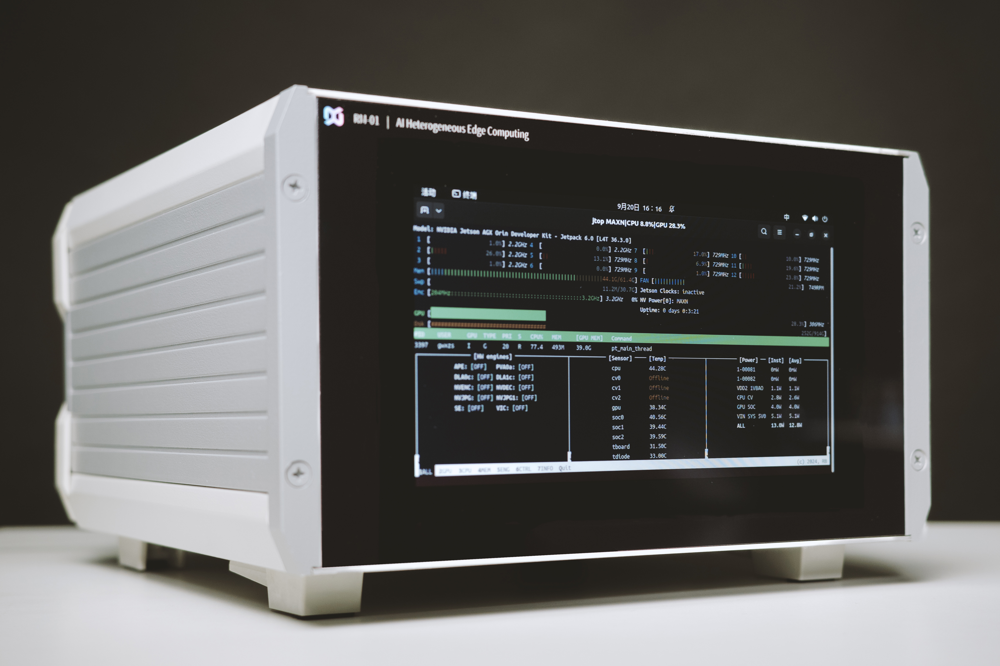
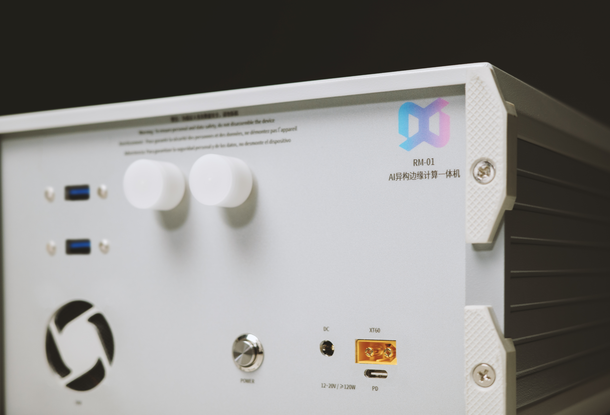
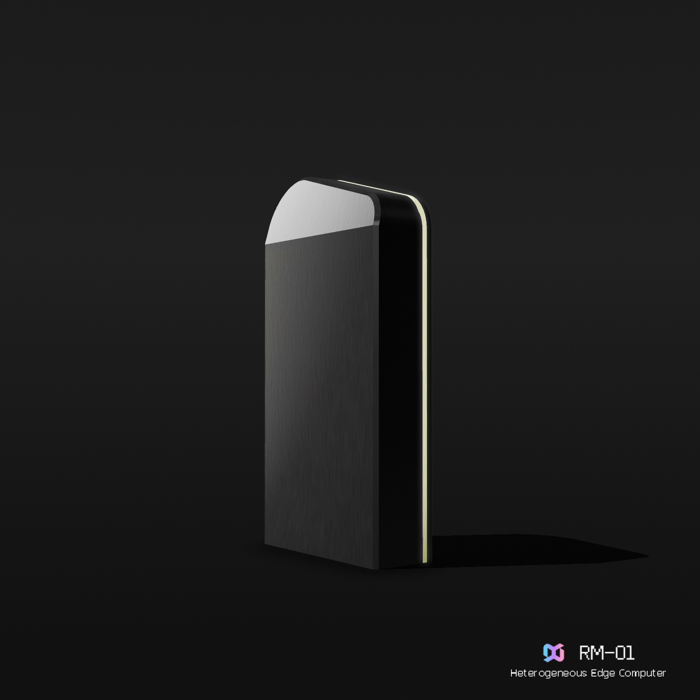

# RMinte | AI异构边缘计算单元

> RM-01a
---

> RM-01c/d（渲染效果图）

## 特征

* **自主知识产权异构计算载板**
* **行业定制 Q-LoRa微调**
* **自研 OSCSNA（Onboard Security Communication Service Network Architecture）架构**
* **Alder Lake-N 全小核处理器**
* **Nvidia Orin 64 × 1  ｜  RM-01a/c/d**
* **Nvidia Orin 64 × 2  ｜  RM-02a/c/d**
* **待机功耗：12W（RM-01）**
* **标准功耗：50W（RM-01）**
* **峰值功耗：90W（RM-01）**

## 认证

CCC、CE、FCC、强制节能认证

## 性能表现

| 任务数  | 推理速度(tokens/s) |
|---------|--------------------|
| 单发    | 4.0                |
| 10并发  | 38.0               |
| 100并发 | 152.7              |
> 模型：Qwen2.5-72B-Int4（上下文长度16K）

| 任务数  | 推理速度(tokens/s) |
|---------|--------------------|
| 单发    | 8.1                |
| 10并发  | 75.4               |
| 100并发 | 303.0              |
> 模型：Qwen2.5-32B-Int4

## 搭载平台

* Dify
* LobyChat
* Qanything
* Ragflow
* LongChain

## 内置应用

* 政府公文小助手系列应用：
* 采用5并发工作流，推理速度19.8tokens/s
* 支持语言（英/西/法/日/韩）
  - 15种法定公文（决议、公告、意见、通知、报告、议案等）
  - 53种其他常用公文（会务类11种、事务类12种、规约类11种等）
* 学业评估及课程创建
* 长文撰写生成
* 幻灯片制作
* 党建学习小助手（鸿蒙原生应用）
* 数字妈祖、少数民族文学研究
* 基于图数据库及LLM的干部评价系统
* ComfyUI全流程应用
  - 基础文生图
  - ICLight
  - 基于Segment的图像/视频融合
  - 图像/视频转绘
  - Reactor换脸
> 可根据用户需求定制各类助手

## 运行Qwen-72B-Int4 模型

1. 强大的逻辑推理、广阔的内容深度、高度的指令遵从、全面支持语音视觉多模态。
2. 显存最高调用率达99.6%。

### 案例：

1. 已开发政府公文应用50余款，提升70%的工作效率；充分满足请示、汇报、总结等场景。
2. 已开发AI客服、工作助手、生产环节回溯推理助手等应用；满足企业多场景应用，支持企业自主开发应用，通过工作流架构成倍降低企业AI研发成本。
3. 已开发AI数字人接入，优化数字人问答逻辑框架、推理框架以及多模态交互框架；重点解决当前数字人内容同质化、空心化的问题。

## 100%离线部署保证：

1. 物理隔离针对敏感行业、敏感地区（对自身资料有严格保密等级的客户）。
2. 数据RAG均本地化处理。

### 案例：

1. 援藏医疗的本地化多语种翻译，解决本地翻译精准度低的难题，避免云端患者隐私的难题以及强大的语义重排解决沟通的理解差异。
2. 完全支持国产化操作系统。

## 低功耗与低成本：

1. 当前运行72B模型及16K上下文需要加载60G的显存，符合此要求的显卡均禁售，RM-01采用的
异构边缘计算单元，完全自主开发，无法律风险。
2. 目前市面AI服务器硬件成本普遍为40-60万元，RM-01型号仅需4.9万元。
3. 标准运行功耗50W，峰值功耗仅90W。

### 案例：
1. 合作方式灵活，租赁、购买、委托开发。
2. 运用于产教融合领域，与学校共建课程。
3. 目前已开发RM-01d开发者版本，方便开发者使用及开发应用。

---

## 测试报告 - Benchmark (Vllm) Qwen2.5-32B-Int4 & 72B-Int4 on Jetson Orin 64G

### Benchmark Qwen2.5-32B-Int4

Benchmarking summary: 
 Time taken for tests: 46.050 seconds
 Expected number of requests: 1
 Number of concurrency: 1
 Total requests: 1
 Succeed requests: 1
 Failed requests: 0
 Average QPS: 0.022
 Average latency: 45.798
 Throughput(average output tokens per second): 8.057
 Average time to first token: 45.798
 Average input tokens per request: 44.000
 Average output tokens per request: 371.000
 Average time per output token: 0.12412
 Average package per request: 1.000
 Average package latency: 45.798
 Max output tokens per second: 8.3
 
 Benchmarking summary: 
 Time taken for tests: 50.150 seconds
 Expected number of requests: 10
 Number of concurrency: 10
 Total requests: 10
 Succeed requests: 10
 Failed requests: 0
 Average QPS: 0.199
 Average latency: 37.731
 Throughput(average output tokens per second): 47.597
 Average time to first token: 37.731
 Average input tokens per request: 49.900
 Average output tokens per request: 238.700
 Average time per output token: 0.02101
 Average package per request: 1.000
 Average package latency: 37.731
 Percentile of time to first token: 
     p50: 39.6797
     p66: 40.9543
     p75: 45.0028
     p80: 45.2550
     p90: 50.0459
     p95: 50.0459
     p98: 50.0459
     p99: 50.0459
 Percentile of request latency: 
     p50: 39.6797
     p66: 40.9543
     p75: 45.0028
     p80: 45.2550
     p90: 50.0459
     p95: 50.0459
     p98: 50.0459
     p99: 50.0459
 Max output tokens per second: 75.4

Benchmarking summary: 
 Time taken for tests: 119.832 seconds
 Expected number of requests: 100
 Number of concurrency: 100
 Total requests: 100
 Succeed requests: 100
 Failed requests: 0
 Average QPS: 0.835
 Average latency: 81.185
 Throughput(average output tokens per second): 193.571
 Average time to first token: 81.185
 Average input tokens per request: 49.890
 Average output tokens per request: 231.960
 Average time per output token: 0.00517
 Average package per request: 1.000
 Average package latency: 81.185
 Percentile of time to first token: 
     p50: 89.5692
     p66: 94.2450
     p75: 95.7965
     p80: 97.7155
     p90: 103.2936
     p95: 105.6626
     p98: 111.9956
     p99: 119.1592
 Percentile of request latency: 
     p50: 89.5692
     p66: 94.2450
     p75: 95.7965
     p80: 97.7155
     p90: 103.2936
     p95: 105.6626
     p98: 111.9956
     p99: 119.1592
 Max output tokens per second: 303
 
 ---
 
 ##¥ Benchmark Qwen2.5-72B-Int4
 
 Benchmarking summary: 
 Time taken for tests: 133.136 seconds
 Expected number of requests: 1
 Number of concurrency: 1
 Total requests: 1
 Succeed requests: 1
 Failed requests: 0
 Average QPS: 0.008
 Average latency: 132.985
 Throughput(average output tokens per second): 3.831
 Average time to first token: 132.985
 Average input tokens per request: 44.000
 Average output tokens per request: 510.000
 Average time per output token: 0.26105
 Average package per request: 1.000
 Average package latency: 132.985
 Max output tokens per second: 4
 
 Benchmarking summary: 
 Time taken for tests: 136.245 seconds
 Expected number of requests: 10
 Number of concurrency: 10
 Total requests: 10
 Succeed requests: 10
 Failed requests: 0
 Average QPS: 0.073
 Average latency: 89.541
 Throughput(average output tokens per second): 24.067
 Average time to first token: 89.541
 Average input tokens per request: 49.900
 Average output tokens per request: 327.900
 Average time per output token: 0.04155
 Average package per request: 1.000
 Average package latency: 89.541
 Percentile of time to first token: 
     p50: 93.4758
     p66: 99.4343
     p75: 104.0851
     p80: 108.4075
     p90: 135.8489
     p95: 135.8489
     p98: 135.8489
     p99: 135.8489
 Percentile of request latency: 
     p50: 93.4758
     p66: 99.4343
     p75: 104.0851
     p80: 108.4075
     p90: 135.8489
     p95: 135.8489
     p98: 135.8489
     p99: 135.8489
 Max output tokens per second: 38
 
 Benchmarking summary: 
 Time taken for tests: 424.544 seconds
 Expected number of requests: 100
 Number of concurrency: 100
 Total requests: 100
 Succeed requests: 100
 Failed requests: 0
 Average QPS: 0.236
 Average latency: 221.434
 Throughput(average output tokens per second): 70.683
 Average time to first token: 221.434
 Average input tokens per request: 49.890
 Average output tokens per request: 300.080
 Average time per output token: 0.01415
 Average package per request: 1.000
 Average package latency: 221.434
 Percentile of time to first token: 
     p50: 234.2268
     p66: 265.4298
     p75: 282.1408
     p80: 291.9766
     p90: 317.7026
     p95: 334.7111
     p98: 371.4026
     p99: 423.9677
 Percentile of request latency: 
     p50: 234.2268
     p66: 265.4298
     p75: 282.1408
     p80: 291.9766
     p90: 317.7026
     p95: 334.7111
     p98: 371.4026
     p99: 423.9677
 Max output tokens per second: 152.7
